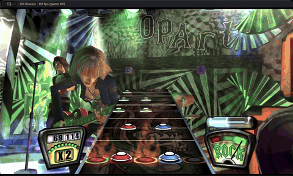

# GH Classic



GH Classic is a recompilation of the PS2 version of Guitar Hero II that runs natively on macOS, Windows and Linux. Much of the code was written using AI ([more on that below](#how-was-ai-used)). While you can play through the entire campaign, know that it's still experimental so expect (and please report any) bugs and glitches.

To run this you need:
- **Your own disc image** of Guitar Hero II (USA), SLUS-21447, as `.chd`, `.iso` or `.bin`
- A GPU with Vulkan support

## Quickstart

Grab the latest [Releases](https://github.com/noahbaxter/GHClassic/releases).

- **Windows and Linux:** unzip anywhere and put your disc image in the `PUT_DISC_HERE` folder beside the game. Settings and saves stay in that folder too. Windows will show a SmartScreen prompt the first time since the exe is unsigned: More info, then Run anyway.
- **macOS:** open the disk image and drag GH Classic to Applications. Run it once and it opens the folder your disc image goes in (`~/Library/Application Support/GHClassic/PUT_DISC_HERE`).

## Status

Nearly feature complete with all of single player working including: career, quickplay, training, the store, encores, options, movies.

Additional features:
- Autodetects keyboard, gamepad and guitar input with the ability to remap
- Independent audio and video latency controls
- Any resolution, uncapped frame rate, MSAA and mipmaps

Still to come:
- Multiplayer (not wired up yet)
- Some rendering effects
- Easier controller mapping (atm it's just an ini)
- GH1, Rocks the 80s and Xbox 360 content

## Controls

| | Keyboard | Gamepad |
|---|---|---|
| Frets | `1` `2` `3` `4` `5` | L2 L1 R1 R2 Cross |
| Strum | Up, Down | D-pad up, down |
| Start | Enter | Start |
| Star power | Right Shift | Select |
| Whammy | | Left stick up |

Certain guitars with built-in profiles should auto detect: PS3, Wii (through a raphnet adapter), Xbox 360, Rock Band 4 and World Tour PC. Anything else can be remapped by editing `input.ini`, which lists every device's current bindings. It sits beside the game on Windows and Linux, and in `~/Library/Application Support/GHClassic` on macOS.
Fullscreen is `Cmd+F` on macOS, `F11` elsewhere.

## Building from source

Needs Git, Python 3.11+, and Xcode Command Line Tools on macOS. Linux also needs a C++ compiler and SDL's build headers (Fedora below; on Bazzite or SteamOS, build in a distrobox).

```sh
git clone --recurse-submodules https://github.com/noahbaxter/GHClassic.git && cd GHClassic
scripts/play.sh "/path/to/Guitar Hero II (USA).iso"   # scripts\play.cmd on Windows
```

<details><summary>Linux packages (Fedora)</summary>

```sh
sudo dnf install gcc-c++ libX11-devel libXext-devel libXrandr-devel libXcursor-devel libXfixes-devel libXi-devel libXScrnSaver-devel libXtst-devel libXinerama-devel libxkbcommon-devel wayland-devel wayland-protocols-devel mesa-libGL-devel mesa-libEGL-devel libdrm-devel mesa-libgbm-devel libdecor-devel alsa-lib-devel pulseaudio-libs-devel pipewire-devel dbus-devel ibus-devel systemd-devel libusb1-devel
```
</details>

## How Was AI Used?

AI was used to write code and nothing else. This README and any other text a user may see is 100% written by me (or the original developers).

No texture, image, video, audio file or any other game asset was generated, upscaled, or otherwise altered by AI. What you see and hear is what's on the disc, just rendered at a higher resolution and framerate. In some cases assets are converted between formats by code so that content from GH1 can load into the GH2 engine.

The game is recompiled with my [fork](https://github.com/noahbaxter/PS2Recomp/tree/ghrecomp) of the [PS2Recomp](https://github.com/ran-j/PS2Recomp) project and runs original game code (mostly) unchanged. Everything built around that core recomp (renderer, audio, input, saves, etc.) was written with Claude Code. All generated code gets reviewed and reworked until I am happy with the shape and structure of it and understand how it works. I've been a professional software developer since 2018 and while this is my first time playing around with emulation/graphics, I am not "vibe coding" something I have no understanding of.

## Credits

This project is built on top of a lot of excellent work by others. Please give most of the credit to these fine folk.

- [PS2Recomp](https://github.com/ran-j/PS2Recomp) ([fork](https://github.com/noahbaxter/PS2Recomp/tree/ghrecomp))
- Project Deluge: debug builds of GH1, GH2 and Rocks the 80s that the function names come from, matched onto the retail executable
- [MiloHax](https://github.com/hmxmilohax): those builds collected ([milo-executable-library](https://github.com/hmxmilohax/milo-executable-library)), menu script references ([milo-script-library](https://github.com/hmxmilohax/milo-script-library)), and [gh2-calibration-fix](https://github.com/hmxmilohax/gh2-calibration-fix)
- [PCSX2](https://github.com/PCSX2/pcsx2) and [psx-spx](https://psx-spx.consoledev.net/): SPU2 reference code/reverb coefficients
- [ps2tek](https://github.com/PSI-Rockin/ps2tek): PS2 hardware reference
- [ps2sdk](https://github.com/ps2dev/ps2sdk) and mymc: memory card format, sound library names
- [libchdr](https://github.com/rtissera/libchdr): reading `.chd` disc images
- [Redump](http://redump.org/): disc hashes the images are checked against
- ([SteamGridDB](https://www.steamgriddb.com/grid/378598)): Temp icon

## License

GPL-3.0, see [LICENSE](LICENSE).

This is an unofficial fan project, not affiliated with or endorsed by Activision, Harmonix or RedOctane. Guitar Hero and all related names, marks and games belong to their owners. This repository does not include any game assets. You need your own copy of the game to build or play it.